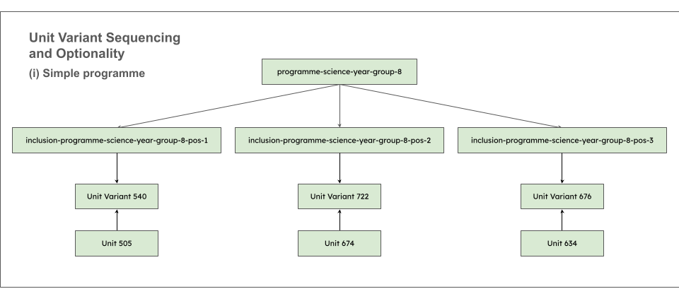
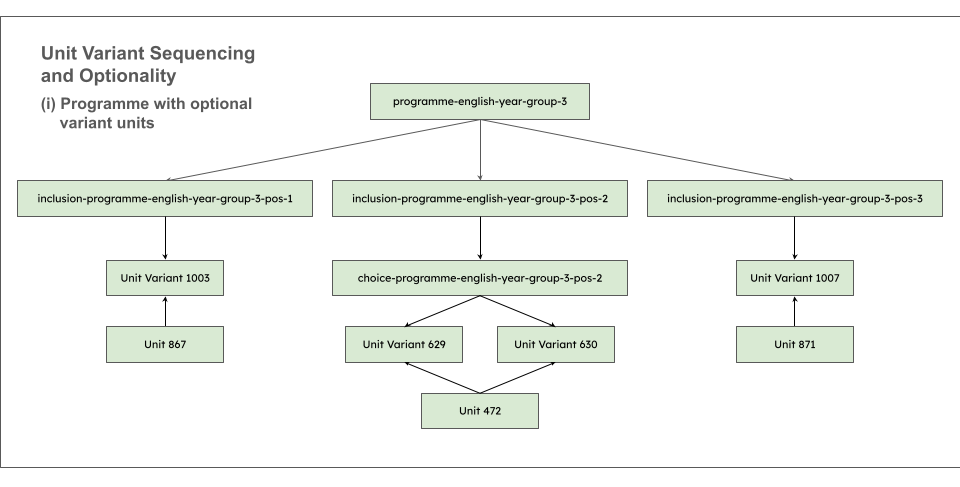
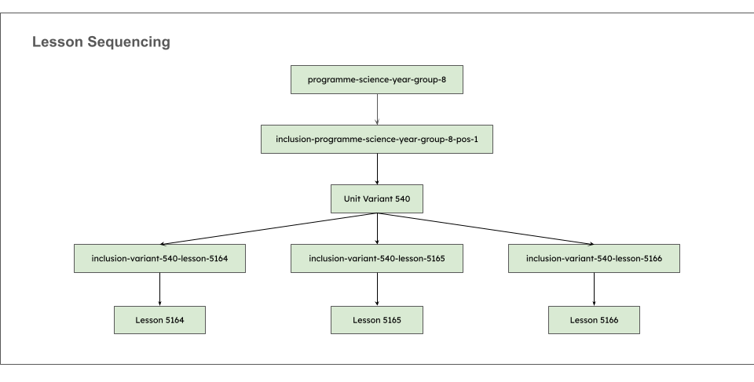
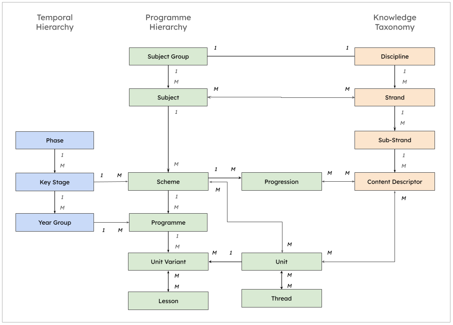

# Oak Curriculum Ontology

<!-- Version and Status Badges -->


<!-- Build and Quality Badges -->
[](https://github.com/oaknational/oak-curriculum-ontology/actions/workflows/validate-ontology.yml)
[](https://github.com/oaknational/oak-curriculum-ontology/actions/workflows/generate-docs-widoco.yml)
[](https://github.com/oaknational/oak-curriculum-ontology/actions/workflows/generate-distributions.yml)

<!-- Standards Badges -->
[](https://www.w3.org/TR/rdf11-primer/)
[](https://www.w3.org/TR/owl2-overview/)
[](https://www.w3.org/TR/skos-reference/)
[](https://www.w3.org/TR/shacl/)

> **A formal semantic representation of the Oak National Academy Curriculum and its alignment to the National Curriculum for England (2014).**

Machine-readable curriculum data in W3C-standard formats (RDF, OWL, SKOS, SHACL) enabling interoperability, semantic queries, and data-driven educational tools. This repository is an Oak-developed representation and does not constitute an official DfE National Curriculum publication.

This repository contains public sector information licensed under the [Open Government Licence v3.0](https://www.nationalarchives.gov.uk/doc/open-government-licence/version/3/).

📘 **[Browse Full Documentation](https://oaknational.github.io/oak-curriculum-ontology/)** |
🔍 **[View Ontology](ontology/oak-curriculum-ontology.ttl)** |
📊 **[Download Distributions](https://github.com/oaknational/oak-curriculum-ontology/releases)**

Developed by [Oak National Academy](https://thenational.academy)

---

## Table of Contents

- [⚠️ Early Release Notice](#️-early-release-notice)
- [What Is This?](#what-is-this)
- [Quick Start](#quick-start)
- [Key Features](#key-features)
- [Core Concepts](#core-concepts)
- [Use Cases](#use-cases)
- [Getting Started](#getting-started)
- [SPARQL Examples](#sparql-examples)
- [File Structure](#file-structure)
- [Standards Compliance](#standards-compliance)
- [Documentation](#documentation)
- [Contributing](#contributing)
- [License](#license)
- [Citation](#citation)
- [Roadmap](#roadmap)

---

## ⚠️ Early Release Notice

This is version 0.1 - an early public release for evaluation and community feedback.
The ontology structure, URIs, and data are under active development and **subject to change**.

- ✅ Core ontology structure is stable
- 🚧 Subject coverage is being expanded
- 🔄 Data validation and refinement ongoing
- 📝 Feedback and suggestions are welcome!

> **Data Notice:** National Curriculum (2014) data is included to demonstrate machine-readable formats ahead of the 2027 revision. As the 2014 curriculum was not designed as structured data, mappings may be incomplete. For educational purposes, use [official sources](https://www.gov.uk/government/collections/national-curriculum).

**We welcome:**
- 🐛 Bug reports (structure, data, documentation)
- 💡 Feature requests and suggestions
- ❓ Questions and feedback (see [CONTRIBUTING.md](CONTRIBUTING.md))

---

## What Is This?

The Oak Curriculum Ontology provides:

**Curriculum Structure** - Formal definitions of programmes, units, lessons, and their relationships

**Knowledge Taxonomy** - Hierarchical subject taxonomies for English, Mathematics, Science, History, Geography, and Citizenship aligned to National Curriculum (2014)

**Validation Rules** - SHACL constraints ensuring data quality and completeness

**Interoperable Data** - W3C-standard RDF enabling integration with any semantic web tool or platform

This ontology bridges official curriculum requirements (National Curriculum 2014) with practical teaching programmes, making curriculum data queryable, analyzable, and machine-processable.

In this version, our knowledge taxonomy is being applied to the knowledge specified in the National Curriculum for England (2014). The data in this repository represents our best efforts to apply a consistent structure where this does not exist in the source content. The taxonomy takes inspiration from a variety of open curriculum sources (see [Acknowledgments](#acknowledgments) below).

---

## Quick Start

```turtle
@prefix curric: <https://w3id.org/uk/oak/curriculum/ontology/> .
@prefix natcurric: <https://w3id.org/uk/oak/curriculum/nationalcurriculum/> .
@prefix oakcurric: <https://w3id.org/uk/oak/curriculum/oakcurriculum/> .
@prefix rdfs: <http://www.w3.org/2000/01/rdf-schema#> .

# Access a Year 7 Mathematics programme
oakcurric:programme-mathematics-year-7
  a curric:Programme ;
  rdfs:label "Mathematics Year 7"@en ;
  curric:hasYearGroup natcurric:year-group-7 ;
  curric:hasSubject natcurric:subject-mathematics ;
  curric:hasUnitVariantInclusion oakcurric:unit-variant-inclusion-1 .
```

**Namespace URIs:**
- `https://w3id.org/uk/oak/curriculum/ontology/` - Ontology classes and properties
- `https://w3id.org/uk/oak/curriculum/nationalcurriculum/` - National Curriculum (2014) data
- `https://w3id.org/uk/oak/curriculum/oakcurriculum/` - Oak curriculum programmes

---

## Key Features

✅ **26 ontology classes** defining curriculum structure (Programme, Unit, Lesson, Discipline, Strand, etc).  
✅ **26 SHACL validation shapes** ensuring data integrity.  
✅ **8 subject areas** with full knowledge taxonomies.  
✅ **National Curriculum alignment** linking Oak content to statutory requirements.  
✅ **Automated validation** via GitHub Actions CI/CD.  
✅ **Multi-format distributions** (Turtle, JSON-LD, RDF/XML, N-Triples).  
✅ **Standards-compliant** (RDF 1.1, OWL 2, SKOS, SHACL, Dublin Core).  
✅ **Open data** (OGL 3.0 license for ontology/data, MIT for code).  

---

## Core Concepts

### Temporal Hierarchy
How curriculum is organized by age and phase:
```
Phase (Primary, Secondary)
  └─ Key Stage (KS1, KS2, KS3, KS4)
      └─ Year Group (Year 1-11)
```

### Knowledge Taxonomy
How subject content is organized hierarchically (SKOS):
```
Discipline (e.g., Science)
  └─ Strand (e.g., "Structure and function of living organisms")
      └─ SubStrand (e.g., "Cells and organisation")
          └─ ContentDescriptor (e.g., "Cells as fundamental unit")
```

**Current subject coverage:**
- **English** - Programme structure and knowledge taxonomy
- **Mathematics** - Programme structure and knowledge taxonomy
- **Science** - Subdivided into Biology, Chemistry, Physics with separate knowledge taxonomies
- **History** - Programme structure and knowledge taxonomy
- **Geography** - Programme structure and knowledge taxonomy
- **Citizenship** - Programme structure and knowledge taxonomy

### Programme Structure
How subjects are organized into teaching programmes:
```
Subject (e.g., Mathematics)
  └─ Programme (e.g., Mathematics Year 7)
      └─ Unit (coherent topic, e.g., "Fractions")
          └─ Unit Variant (exam board variations)
              └─ Lesson (individual teaching session)
```

### Key Classes

**Programme**: A structured sequence of units for a specific year group, and optionally for a specific exam board and tier. For example, "English Year 3" or "Biology Year 10 (AQA Foundation)".

**Unit**: A coherent body of knowledge and skills, such as "'Marcy and the Riddle of the Sphinx': book club". Units can have multiple unit variants for different exam boards or pedagogical approaches.

**UnitVariant**: A specific version of a unit, potentially adapted for different exam boards, tiers, or teaching contexts. Unit variants contain the ordered sequence of lessons.

**Lesson**: A single teaching session with learning activities, resources, and formative assessment.

**Thread**: A conceptual thread that weaves through multiple units, representing recurring themes or skills (e.g., "Systems Thinking", "Scale and Magnitude").

**ExamBoard**: An awarding organization (AQA, Edexcel, OCR) that creates and assesses qualifications.

**Tier**: A level of difficulty within tiered qualifications (Foundation or Higher).

### Sequencing and Optionality

**UnitVariantInclusion**: Links a programme to a unit variant at a specific sequence position. Can include choice points where teachers select from multiple unit variant options.

**LessonInclusion**: Links a unit variant to a lesson at a specific sequence position within the unit variant.

**UnitVariantChoice**: Groups multiple unit variant options at a choice point, with configurable min/max selection constraints.





### National Curriculum Integration

Oak units reference National Curriculum content via:
- `curric:isProgrammeOf` - Links a programme to a National Curriculum scheme
- `curric:isUnitOf` - Links a unit to a National Curriculum scheme
- `curric:includesContent` - Links a unit to specific National Curriculum content descriptors



---

## Use Cases

**Educational Platforms** - Load curriculum data into learning management systems.  
**Curriculum Analysis** - Query relationships between subjects, key stages, and topics.  
**AI/ML Training** - Use structured curriculum data for educational AI models.  
**Research** - Analyze curriculum structure, progression, and coverage.  
**Data Integration** - Link to other educational datasets via persistent URIs.  
**Quality Assurance** - Validate custom curriculum data against standard shapes.  
**Graph Databases** - Export to Neo4j for network analysis and visualization.  
**Semantic Search** - Enable intelligent discovery of curriculum content.  

---

## Getting Started

### Option 1: Download Distribution Files

Pre-generated RDF files in multiple formats available from [GitHub Releases](https://github.com/oaknational/oak-curriculum-ontology/releases):

```bash
# Download Turtle (compact, human-readable)
curl -L -O https://github.com/oaknational/oak-curriculum-ontology/releases/download/v0.1.0/oak-curriculum-full.ttl

# Download JSON-LD (for web apps)
curl -L -O https://github.com/oaknational/oak-curriculum-ontology/releases/download/v0.1.0/oak-curriculum-full.jsonld

# Download RDF/XML (for legacy tools)
curl -L -O https://github.com/oaknational/oak-curriculum-ontology/releases/download/v0.1.0/oak-curriculum-full.rdf

# Download N-Triples (for streaming/line-based processing)
curl -L -O https://github.com/oaknational/oak-curriculum-ontology/releases/download/v0.1.0/oak-curriculum-full.nt
```

**Available formats:**
- `.ttl` (Turtle) - Compact, human-readable
- `.jsonld` (JSON-LD) - JSON-based RDF for web apps
- `.rdf` (RDF/XML) - XML-based RDF for legacy tools
- `.nt` (N-Triples) - Line-based format for streaming

### Option 2: Load into Triple Store

```bash
# Example with Apache Jena TDB2
tdb2.tdbloader --loc=/path/to/database \
  ontology/oak-curriculum-ontology.ttl \
  data/**/*.ttl

# Example with GraphDB
graphdb-import -c /path/to/repo-config.ttl ontology/*.ttl data/**/*.ttl
```

### Option 3: Validate Data

```bash
# Run local validation (matches CI/CD exactly)
./scripts/validate.sh
```

This validates all TTL files against SHACL constraints with RDFS inference.

### Option 4: Export to Neo4j

```bash
# Export to Neo4j graph database with transformations
python scripts/export_to_neo4j.py --config scripts/export_to_neo4j_config.json

# Clear database first, then export fresh
python scripts/export_to_neo4j.py --config scripts/export_to_neo4j_config.json --clear
```

See [scripts/README.md](scripts/README.md) for detailed tool documentation.

---

## SPARQL Examples

### Find all Year 7 programmes

```sparql
PREFIX curric: <https://w3id.org/uk/oak/curriculum/ontology/>
PREFIX natcurric: <https://w3id.org/uk/oak/curriculum/nationalcurriculum/>
PREFIX rdfs: <http://www.w3.org/2000/01/rdf-schema#>

SELECT ?programme ?label WHERE {
  ?programme a curric:Programme ;
             curric:coversYearGroup natcurric:year-group-7 ;
             rdfs:label ?label .
}
ORDER BY ?label
```

### Find Mathematics content descriptors

```sparql
PREFIX curric: <https://w3id.org/uk/oak/curriculum/ontology/>
PREFIX natcurric: <https://w3id.org/uk/oak/curriculum/nationalcurriculum/>
PREFIX skos: <http://www.w3.org/2004/02/skos/core#>

SELECT ?descriptor ?label WHERE {
  natcurric:discipline-mathematics skos:narrower+ ?descriptor .
  ?descriptor a curric:ContentDescriptor ;
              skos:prefLabel ?label .
}
ORDER BY ?label
```

### List units in sequence for a programme

```sparql
PREFIX curric: <https://w3id.org/uk/oak/curriculum/ontology/>
PREFIX oakcurric: <https://w3id.org/uk/oak/curriculum/oakcurriculum/>
PREFIX rdfs: <http://www.w3.org/2000/01/rdf-schema#>

SELECT ?position ?unitVariant ?label WHERE {
  oakcurric:programme-mathematics-year-group-7
    curric:hasUnitVariantInclusion ?inclusion .
  ?inclusion curric:sequencePosition ?position ;
             curric:includesUnitVariant ?unitVariant .
  ?unitVariant rdfs:label ?label .
}
ORDER BY ?position
```

### Find programmes by subject

```sparql
PREFIX curric: <https://w3id.org/uk/oak/curriculum/ontology/>
PREFIX natcurric: <https://w3id.org/uk/oak/curriculum/nationalcurriculum/>
PREFIX rdfs: <http://www.w3.org/2000/01/rdf-schema#>

SELECT ?subject ?subjectLabel ?programme ?programmeLabel WHERE {
  ?programme a curric:Programme ;
             rdfs:label ?programmeLabel ;
             curric:isProgrammeOf ?scheme .
  ?scheme curric:isSchemeOf ?subject .
  ?subject rdfs:label ?subjectLabel .
}
ORDER BY ?subjectLabel ?programmeLabel
```

### Find all Key Stage 3 Science content

```sparql
PREFIX curric: <https://w3id.org/uk/oak/curriculum/ontology/>
PREFIX natcurric: <https://w3id.org/uk/oak/curriculum/nationalcurriculum/>
PREFIX skos: <http://www.w3.org/2004/02/skos/core#>

SELECT DISTINCT ?content ?label WHERE {
  natcurric:discipline-science skos:narrower+ ?content .
  ?content skos:prefLabel ?label .
}
ORDER BY ?label
```

---

## File Structure

```
oak-curriculum-ontology/
├── ontology/
│   ├── oak-curriculum-ontology.ttl       # Core classes & properties (26 classes)
│   └── oak-curriculum-constraints.ttl    # SHACL validation shapes (26 shapes)
│
├── data/
│   ├── temporal-structure.ttl            # Phases, Key Stages, Year Groups
│   ├── programme-structure.ttl           # Exam Boards, Tiers
│   ├── threads.ttl                       # Cross-cutting Threads
│   └── subjects/
│       ├── citizenship/
│       │   ├── citizenship-programme-structure.ttl     # Subject, Schemes, Progressions
│       │   ├── citizenship-knowledge-taxonomy.ttl      # Strands, Sub-Strands, Content Descriptors
│       │   └── citizenship-key-stage-*.ttl             # KS1-KS4 Programmes, Units, Unit Variants, Lessons
│       ├── english/
│       │   ├── english-programme-structure.ttl
│       │   ├── english-knowledge-taxonomy.ttl
│       │   └── english-key-stage-*.ttl
│       ├── geography/
│       │   ├── geography-programme-structure.ttl
│       │   ├── geography-knowledge-taxonomy.ttl
│       │   └── geography-key-stage-*.ttl
│       ├── history/
│       │   ├── history-programme-structure.ttl
│       │   ├── history-knowledge-taxonomy.ttl
│       │   └── history-key-stage-*.ttl
│       ├── mathematics/
│       │   ├── mathematics-programme-structure.ttl
│       │   ├── mathematics-knowledge-taxonomy.ttl
│       │   └── mathematics-key-stage-*.ttl
│       └── science/
│           ├── biology-key-stage-4.ttl
│           ├── biology-knowledge-taxonomy.ttl
│           ├── biology-programme-structure.ttl
│           ├── chemistry-key-stage-4.ttl
│           ├── chemistry-knowledge-taxonomy.ttl
│           ├── chemistry-programme-structure.ttl
│           ├── combined-science-key-stage-4.ttl
│           ├── physics-key-stage-4.ttl
│           ├── physics-knowledge-taxonomy.ttl
│           ├── physics-programme-structure.ttl
│           ├── science-key-stage-1.ttl
│           ├── science-key-stage-2.ttl
│           ├── science-key-stage-3.ttl
│           └── science-programme-structure.ttl
│
├── docs/
│   └── standards-compliance.md           # W3C standards documentation
│
├── scripts/
│   ├── build_static_data.sh              # Generate distribution files (for releases)
│   ├── export_to_neo4j_ARCHITECTURE.md   # Neo4j export architecture documentation
│   ├── export_to_neo4j_config.json       # Neo4j export configuration
│   ├── export_to_neo4j.py                # Export to Neo4j with transformations
│   ├── merge_ttls_with_imports.py        # Merge TTL files with import resolution
│   ├── README.md                         # Scripts documentation
│   ├── test_sparql_queries.py            # Testing for valid SPARQL queries
│   └── validate.sh                       # Local SHACL validation
│
├── .github/workflows/
│   ├── generate-distributions.yml        # Build distribution files
│   ├── generate-docs-widoco.yml          # Auto-generate documentation
│   ├── README.md                         # Workflows documentation
│   └── validate-ontology.yml             # Automated SHACL validation
│
├── .env.example                          # Example environment configuration for Neo4j
├── CITATION.cff                          # Citation metadata
├── CODE-LICENSE.md                       # MIT License (for code)
├── CONTRIBUTING.md                       # Contribution guidelines
├── DATA-LICENSE.md                       # OGL 3.0 (for ontology/data)
├── pyproject.toml                        # Python configuration and dependencies
├── README.md                             # This file
└── SECURITY.md                           # Policy and vulnerability reporting
```

---

## Standards Compliance

This ontology achieves compliance with W3C Recommendations and international standards:

### W3C Standards

- **RDF 1.1** ([W3C Recommendation](https://www.w3.org/TR/rdf11-primer/)) - Universal data model for linked data
- **OWL 2** ([W3C Recommendation](https://www.w3.org/TR/owl2-overview/)) - Formal ontology with 26 classes and 40+ properties
- **SKOS** ([W3C Recommendation](https://www.w3.org/TR/skos-reference/)) - Knowledge taxonomy with hierarchical relationships
- **SHACL** ([W3C Recommendation](https://www.w3.org/TR/shacl/)) - 26 validation shapes for data quality

### Metadata Standards

- **Dublin Core** ([DCMI Terms](https://www.dublincore.org/specifications/dublin-core/dcmi-terms/)) - Comprehensive metadata for provenance and versioning
- **Schema.org** - Future compatibility with educational extensions for web discoverability

### Best Practices

- **Persistent URIs** - w3id.org namespace for long-term stability
- **Semantic Versioning** - Clear version tracking following semver.org
- **Linked Data Principles** - Following Tim Berners-Lee's 4 principles
- **Content Negotiation** - Support for multiple RDF formats

### Validation & Quality

- **Automated CI/CD** - GitHub Actions validate every commit
- **SHACL Constraints** - 26 shapes ensure structural integrity
- **Test Coverage** - Validation shapes cover all major classes

📋 **[Read full standards compliance documentation →](docs/standards-compliance.md)**

This document explains:
- How each W3C standard is implemented
- Examples of standard usage in the ontology
- Benefits of standards compliance
- Interoperability achievements

---

## Documentation

### Auto-Generated Ontology Documentation

Complete HTML documentation with class hierarchies, properties, and visualizations:

📘 **[Browse Full Documentation](https://oaknational.github.io/oak-curriculum-ontology/)**

Generated automatically via WIDOCO on each release, includes:
- Complete class and property definitions
- Domain and range specifications
- Visual diagrams and WebVOWL visualization
- Downloadable formats

### Repository Documentation

- 📋 **[Standards Compliance](docs/standards-compliance.md)** - W3C standards and semantic web best practices
- 🔧 **[Scripts and Tools](scripts/README.md)** - Validation, export, and build utilities
- 🏗️ **[Neo4j Export Architecture](scripts/export_to_neo4j_ARCHITECTURE.md)** - Detailed export pipeline documentation
- 📖 **[Citation Metadata](CITATION.cff)** - Machine-readable citation for academic use
- 🤝 **[Contributing Guidelines](CONTRIBUTING.md)** - How to contribute to this project

---

## Contributing

We welcome feedback and suggestions from the community!

**During this early release (v0.1.0), we welcome:**
- 🐛 Bug reports - Issues with data quality, structure, or documentation
- 💡 Feature suggestions - Ideas for improvements or additions
- 📝 Documentation feedback - Clarifications, corrections, or enhancements
- ❓ Questions - About the ontology, data model, or usage

**How to contribute:**
1. Read [CONTRIBUTING.md](CONTRIBUTING.md) for detailed guidelines
2. [Open an issue](https://github.com/oaknational/oak-curriculum-ontology/issues) to share your feedback
3. Provide clear context and examples

**Note:** We are not accepting pull requests during v0.1.0 while we refine the ontology structure and establish governance processes. See [CONTRIBUTING.md](CONTRIBUTING.md) for details.

---

## License

This repository uses **dual licensing** to appropriately cover different types of content:

### Ontology and Data (OGL 3.0)

The curriculum ontology, vocabulary definitions, and curriculum data are licensed under [Open Government Licence v3.0 (OGL 3.0)](DATA-LICENSE.md).

**Applies to:**
- `ontology/` - OWL/SKOS ontology files
- `data/` - Curriculum instance data
- `docs/` - Documentation

**What you can do:**
- ✅ Use for any purpose (commercial or non-commercial)
- ✅ Copy, modify, and redistribute
- ✅ Build applications and services
- ⚠️ Must provide attribution: "Oak National Academy"

### Code (MIT License)

All Python scripts, GitHub Actions workflows, and software tools are licensed under the [MIT License](CODE-LICENSE.md).

**Applies to:**
- `scripts/` - Scripts and Python code
- `.github/workflows/` - CI/CD automation

**What you can do:**
- ✅ Use, modify, and redistribute freely
- ✅ Use in commercial projects
- ✅ Minimal restrictions
- ⚠️ Must provide attribution: "Oak National Academy"

---

## Citation

If you use this ontology in your research, please cite it using the "Cite this repository" button on GitHub, which provides citations in BibTeX, APA, Chicago, and other formats.

Alternatively, see [CITATION.cff](CITATION.cff) for machine-readable citation metadata.

---

## Roadmap

### v0.1.0 (Current - February 2026)
- ✅ Core ontology structure (26 classes, 40+ properties)
- ✅ 8 subjects with knowledge taxonomies
- ✅ SHACL validation (26 shapes)
- ✅ Automated CI/CD pipelines
- ✅ Multi-format distributions (Turtle, JSON-LD, RDF/XML, N-Triples)
- ✅ Neo4j export tooling
- ✅ Standards compliance documentation

### Future Plans
- Additional subjects (Computing, Art, Music, PE, Languages etc.)
- Public SPARQL endpoint deployment
- HTTP content negotiation supporting HTML, TTL, JSON-LD, RDF/XML and N-Triples
- Learning resource integration using LRMI standards (videos, worksheets, assessments etc.)
- Progression models and learning pathways
- Enhanced documentation

**Feedback welcome!** If you have suggestions for the roadmap, [open an issue](https://github.com/oaknational/oak-curriculum-ontology/issues).

---

## Related Resources

- [Oak National Academy](https://www.thenational.academy/) - Free, high-quality curriculum resources for UK schools
- [National Curriculum for England](https://www.gov.uk/government/collections/national-curriculum) - Official statutory requirements
- [UK Government Linked Data](https://www.data.gov.uk/) - UK public sector open data
- [W3C Semantic Web](https://www.w3.org/standards/semanticweb/) - Standards and specifications
- [Schema.org Education](https://schema.org/EducationalOrganization) - Educational markup vocabulary

---

## Acknowledgments

This ontology was developed by Oak National Academy with input from:
- Educational domain experts
- Semantic web practitioners
- UK curriculum specialists
- Open data community

Special thanks to the broader semantic web and open education communities for their tools, standards, and best practices. In particular, our knowledge taxonomy has been inspired by the following work:

- [Australian Curriculum](https://www.bbc.co.uk/ontologies/curriculum) published by the Australian Curriculum, Assessment and Reporting Authority (ACARA).  
- [BBC Curriculum Ontology](https://www.bbc.co.uk/ontologies/curriculum) published by the BBC, for describing the National Curricula within the UK.

---

## Contact

For questions, suggestions, or collaboration opportunities:

- **GitHub Issues**: [Report an issue](https://github.com/oaknational/oak-curriculum-ontology/issues)
- **Documentation**: [https://oaknational.github.io/oak-curriculum-ontology/](https://oaknational.github.io/oak-curriculum-ontology/)

---

**Developed by [Oak National Academy](https://thenational.academy)**
